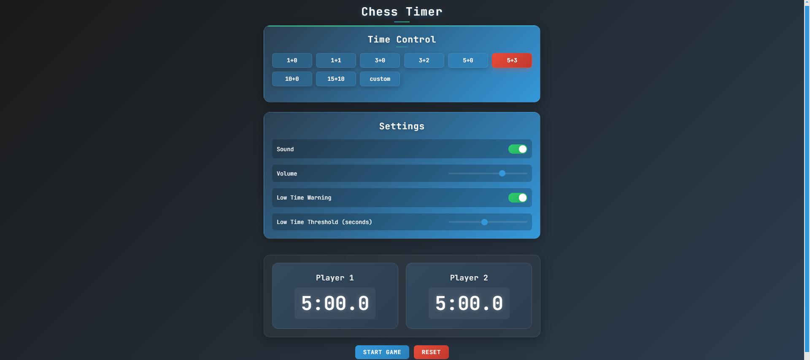

# ⏱️ Chess Timer

A modern, responsive chess timer built with React and TypeScript. Features a sleek dark theme, intuitive controls, and professional-grade accuracy for serious chess players.

## ✨ Features

- 🎮 **Intuitive Controls**
  - Space bar control for switching active player
  - Click/tap support for mobile devices
  - Visual and audio feedback

- ⚡ **Professional Grade**
  - Precise timing with 0.1-second accuracy
  - Multiple preset time controls
  - Custom time control configuration
  - Increment support

- 🎨 **Modern Design**
  - Clean, minimalist interface
  - Dark theme for reduced eye strain
  - Responsive layout for all devices
  - Visual indicators for active player and low time

- ⚙️ **Time Controls**
  - **Bullet:** 1+0, 1+1
  - **Blitz:** 3+0, 3+2, 5+0, 5+3
  - **Rapid:** 10+0, 15+10
  - **Custom:** Configure your own time control

## 🚀 Quick Start

### Prerequisites

- Node.js (v14 or higher)
- npm (v6 or higher)

### Installation

1. Clone the repository:
\`\`\`bash
git clone https://github.com/ahmed5145/chess-timer.git
cd chess-timer
\`\`\`

2. Install dependencies:
\`\`\`bash
npm install
\`\`\`

3. Start the development server:
\`\`\`bash
npm start
\`\`\`

Visit `http://localhost:3000` in your browser.

## 🎮 Usage

1. **Select Time Control**
   - Choose from preset time controls (1+0, 3+2, 5+3, etc.)
   - Or create a custom time control

2. **Start Game**
   - Click the "Start" button
   - Player 1's timer will begin counting down

3. **During Play**
   - Press SPACE to switch between players
   - Click/tap the active player's timer
   - Use the pause button for breaks

4. **Game End**
   - Timer reaches zero
   - Click "Reset" for a new game
   - Change time control if desired

## 🛠️ Technical Details

### Architecture

- **Frontend:** React with TypeScript
- **State Management:** Redux Toolkit
- **Styling:** Styled Components
- **Build Tool:** Create React App

### Key Features Implementation

- Precise timing using `setInterval` with 100ms updates
- Efficient state management with Redux Toolkit
- Responsive design using CSS Grid and Flexbox
- Type-safe development with TypeScript
- Modern styling with Styled Components

## 🤝 Contributing

Contributions are welcome! Here's how you can help:

1. Fork the repository
2. Create a feature branch (\`git checkout -b feature/AmazingFeature\`)
3. Commit your changes (\`git commit -m 'Add some AmazingFeature'\`)
4. Push to the branch (\`git push origin feature/AmazingFeature\`)
5. Open a Pull Request

## 📝 License

This project is licensed under the MIT License - see the [LICENSE](LICENSE) file for details.

## 🙏 Acknowledgments

- Inspired by professional chess clock designs
- Built with modern React best practices
- Focused on reliability and user experience
- Special thanks to the React and TypeScript communities

## 📱 Screenshots

### Desktop View

## 📧 Contact

Ahmed Mohamed - ahmedmohamed200354@gmail.com

Project Link: [https://github.com/ahmed5145/chess-timer](https://github.com/ahmed5145/chess-timer)
